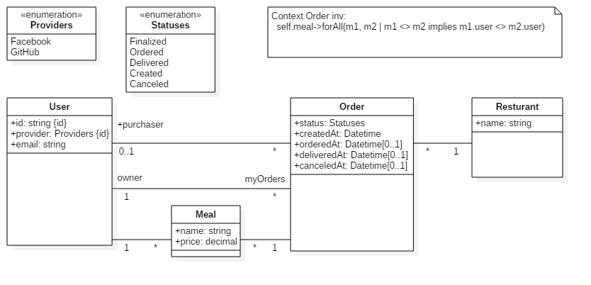

# Meal ordering coordination system
[](https://travis-ci.org/w0st/mocs)
### Model
Proposition for conceptual model



### Accepted rules
Directory **api** contains source code related to back-end part of the system.

Directory **angular** contains files connected with front-end part.

Similar rules apply to the commit messages.

Active order has status: Created/Finalized/Ordered

History order has status: Delivered/Canceled


### Tests
I've prepared a few specs for controllers and models using rspec.
You can execute them by: ```rspec spec/``` inside ***api*** directory.

### Notices

I've tried [angular2-jsonapi](https://github.com/ghidoz/angular2-jsonapi), but at the time isn't too stable...

datatable-row-detail-template not working with nested *ngFor.

